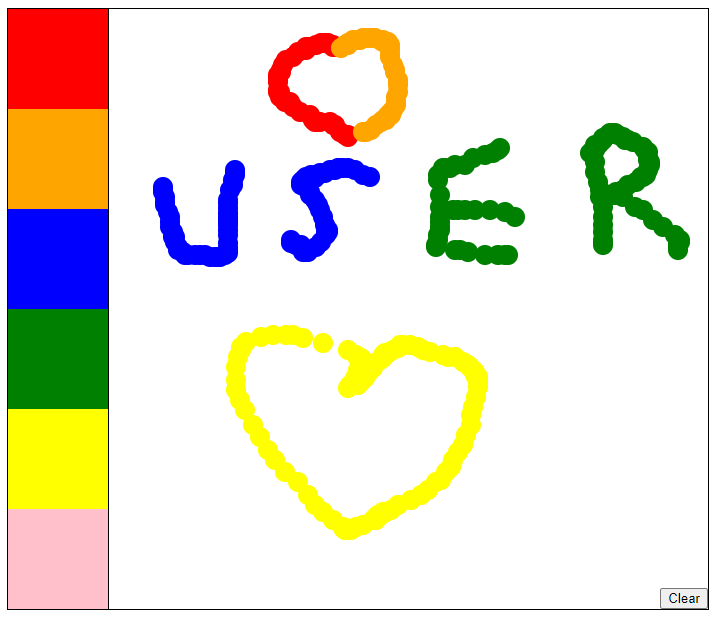

# Canvas-draw
## Introduction
>With the goal of practising Javascript, I have done this project on my free time.This project allows user to draw on a webpage.
## Overview

## Users'guide
Users can select color pallete on the left side to draw. They can draw by clicking 'mousedown'(drawing) and 'mouseup'(stopping).

Referece:"Pham Huy Hoang youtube channel"
